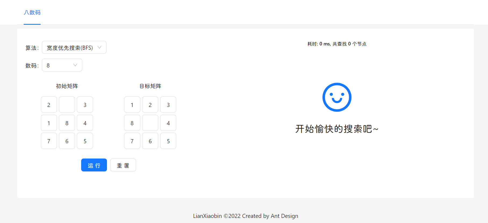
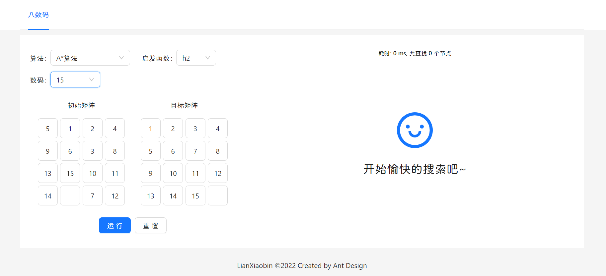
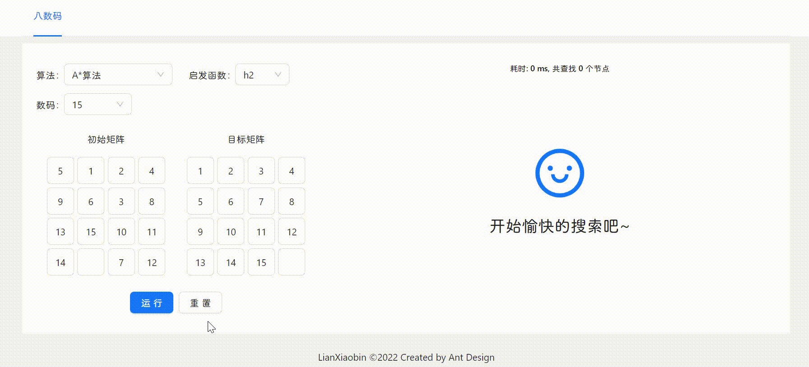

# 八数码问题

## 在线预览

[点击进入](https://eight-puzzle.netlify.app)







## 实验报告

[点击进入](https://www.yuque.com/arcturus/debug/ebuqk1)

## 本地开发

```bash
git clone https://github.com/ICE99125/ai-homework.git
```

```bash
cd ./ai-homework
```

安装依赖(需要下载 pnpm)

```bash
pnpm install
```

启用本地服务器

```bash
pnpm run dev
```

## 目录结构

```
src
  ├─components                # 自定义组件
  ├─App.tsx
  ├─index.css                 # 全局样式
  ├─main.tsx
  ├─type.d.ts                 # 全局类型声明
  ├─vite-env.d.ts
  ├─store
  └─utils
    ├─A.ts                    # A* 算法
    ├─bfs.ts                  # 宽度优先搜索
    ├─dfs.ts                  # 深度优先搜索
    └─tool.ts                 # 一些公共函数
```

## 功能

- [x] 求解过程可视化
- [x] 能够选择不同的算法
- [x] 能够主动输入起始矩阵和目标矩阵
