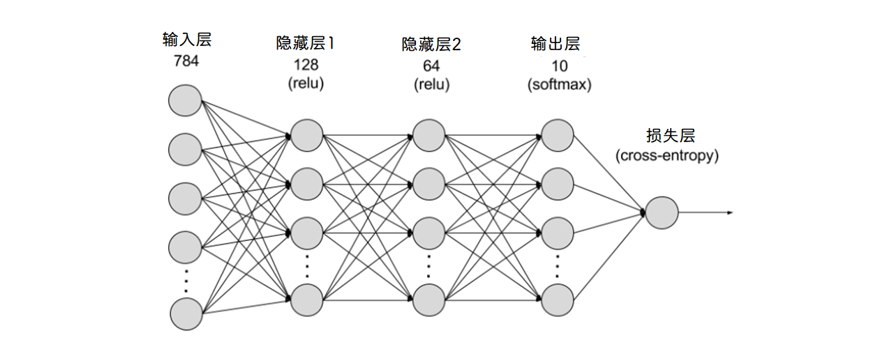
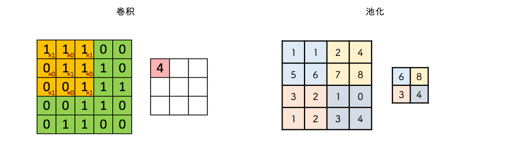
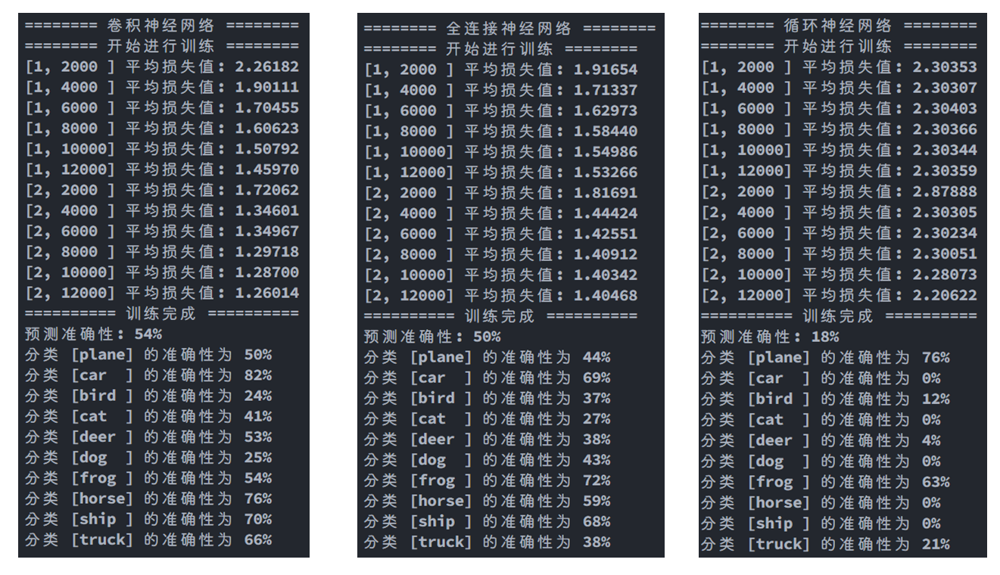
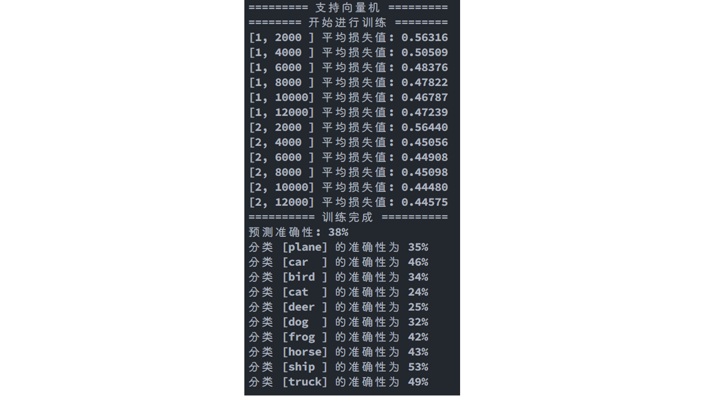

# 机器学习实验报告

##  实验目的

分别使用全连接网络，卷积神经网络，循环神经网络，SVM去预测数据

## 实验原理



输入进过一系列隐藏层, 根据权重 `w` 和阈值 `b` 计算得到输出, 一个感知机能获得一个输出, 但能发送给下一层多个感知机, 训练过程就是计算和更新 `w` 和 `b` 使得损失(即与真值的差异)越来越小的过程, 这个过程和求极值类似, 沿着损失函数梯度下降最快的方向计算, 也称 `梯度下降法` 

卷积神经网络在全连接之前进行了 `卷积` 和 `池化` 两步, 卷积过程将图片的特征进行提取, 得到多个特征图, 池化过程进行数据降维, 减少数据量, 避免过拟合, 主要是提取区域内最大值



循环神经网络跟传统神经网络最大的区别在于每次都会将前一次的输出结果, 带到下一次的隐藏层中, 一起训练

## 环境搭建(anaconda)

### 创建虚拟环境

```bash
conda create -n pytorch-cpu python=3.10
```

### 激活虚拟环境

```bash
conda activate pytorch-cpu
```

### 换源

```bash
conda config --add channels https://mirrors.tuna.tsinghua.edu.cn/anaconda/pkgs/free/ 
conda config --add channels https://mirrors.tuna.tsinghua.edu.cn/anaconda/pkgs/main/ 
conda config --set show_channel_urls yes
```

### 安装 pytorch

```bash
conda install pytorch torchvision cpuonly
```

## 实验算法

### 深度神经网络

#### 全连接

```python
class FCNN(nn.Module):
    def __init__(self):
        super().__init__()

        self.fc1 = nn.Linear(32 * 32 * 3, 500)
        self.fc2 = nn.Linear(500, 200)
        self.fc3 = nn.Linear(200, 10)

    def forward(self, x):
        x = x.view(x.size(0), -1)
        x = self.fc1(x)
        x = self.fc2(torch.relu(x))
        x = self.fc3(torch.relu(x))

        return x
```

#### 卷积神经网络

```python
class CNN(nn.Module):
    def __init__(self):
        super().__init__()

        # 二维卷积层
        self.conv1 = nn.Conv2d(3, 6, 5)
        self.conv2 = nn.Conv2d(6, 16, 5)

        # 最大池化层
        self.pool = nn.MaxPool2d(2, 2)

        # 三个全连接层
        self.fc1 = nn.Linear(16 * 5 * 5, 120)
        self.fc2 = nn.Linear(120, 84)
        self.fc3 = nn.Linear(84, 10)

    # 前向传播
    def forward(self, x):
        x = self.pool(F.relu(self.conv1(x)))
        x = self.pool(F.relu(self.conv2(x)))
        x = x.view(-1, 16 * 5 * 5)
        x = F.relu(self.fc1(x))
        x = F.relu(self.fc2(x))
        x = self.fc3(x)

        return x
```

#### 循环神经网络

```python
class RNN(nn.Module):
    def __init__(self):
        super().__init__()

        self.lstm = nn.LSTM(32 * 3, 128, batch_first=True, num_layers=5)
        self.line1 = nn.Linear(128, 128)
        self.line2 = nn.Linear(128, 10)

    # 前向传播
    def forward(self, x):
        x = x.view(-1, 32, 32 * 3)
        x, _ = self.lstm(x)
        x = self.line1(x[:, -1, :])
        x = self.line2(x)

        return x
```

### SVM

```python
class SVM(nn.Module):
    def __init__(self):
        super().__init__()
        self.fc = nn.Linear(32 * 32 * 3, 10, bias=True)

    def forward(self, x):
        x = x.view(x.size(0), -1)
        x = self.fc(x)
        return x
```

## 实验结果

### 神经网络



### SVM



这几个算法都半径八两, 准确性都不算高, 也可能是我只训练了两轮的原因, 但是循环神经网络那个实在是太久了, 不想再多几轮了, 就这样吧, SVM 训练到 15 轮准确性都没提高